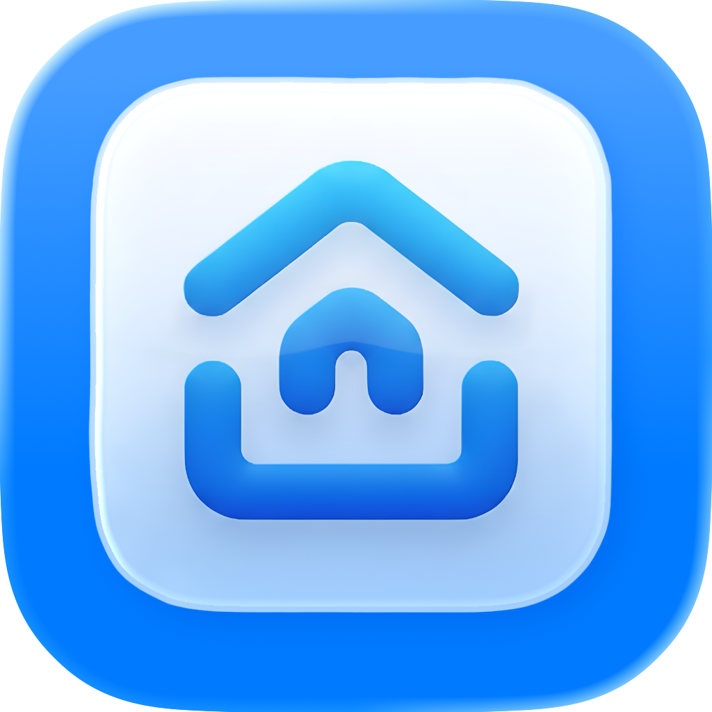

# EdgeBox - Local LLM Agent Sandbox

<div align="center">
  
</div>

EdgeBox is a local desktop application that brings E2B's powerful sandbox capabilities to your desktop. Based on the open-source E2B code interpreter project, EdgeBox transforms the cloud-based sandbox into a locally-running environment, giving you full control over your AI agent development and testing environment.

**What makes EdgeBox unique**: While most open-source sandbox projects only provide terminal/CLI environments, EdgeBox offers **both terminal AND GUI environments** through MCP tools, enabling true **Computer Use** capabilities for AI agents. Your LLMs can not only execute code but also interact with desktop applications, browsers, and visual interfaces.

## 📖 Table of Contents

- [🚀 Key Features](#-key-features)
- [🏗️ Architecture](#️-architecture)
- [📋 Prerequisites](#-prerequisites)
- [🛠️ Installation](#️-installation)
- [🎯 Usage](#-usage)
  - [Quick Start](#quick-start)
  - [MCP Client Configuration](#mcp-client-configuration)
  - [Using EdgeBox with LLMs](#using-edgebox-with-llms)
  - [Multi-Session Concurrent Sandboxes](#multi-session-concurrent-sandboxes)
  - [Configuration](#configuration)
  - [Docker Integration](#docker-integration)
- [🔐 Security](#-security)
- [📄 License](#-license)
- [🙏 Acknowledgments](#-acknowledgments)
- [🔗 Related Projects](#-related-projects)
- [📞 Support](#-support)

## 🚀 Key Features

### MCP HTTP Streamable Protocol Integration
- **Universal LLM Access**: All sandbox capabilities exposed through MCP (Model Context Protocol) HTTP Streamable interface
- **Standard Protocol**: Compatible with any LLM client that supports MCP, including Claude Desktop, ChatGPT, and open-source clients like Cherry Studio, OpenWebUI
- **Session Management**: Multi-session support with isolated environments for concurrent LLM interactions

### Core Sandbox Capabilities
- **Local Code Execution**: Run AI-generated code securely in isolated Docker containers
- **File System Management**: Full filesystem access with create, read, write, and delete operations
- **Multi-language Support**: Execute Python, JavaScript, and other languages in isolated environments
- **Container Orchestration**: Automated Docker container lifecycle management

### Desktop Environment
- **VNC Integration**: Full desktop GUI access through integrated VNC viewer
- **Application Support**: Pre-configured with Chrome, VS Code, and other desktop applications
- **Mouse & Keyboard Control**: Programmatic control of desktop interactions
- **Screenshot Capabilities**: Built-in screenshot functionality for GUI automation

### Advanced Features
- **MCP Server Integration**: Model Context Protocol server for seamless LLM integration
- **Resource Management**: Configurable CPU cores and memory limits for containers
- **Session Management**: Multiple concurrent sandbox sessions with isolation

## 🏗️ Architecture

EdgeBox is built with:
- **Frontend**: Electron + React + TypeScript + Tailwind CSS
- **Backend**: Node.js with Docker API integration
- **Containerization**: Docker for secure sandbox isolation
- **UI Components**: Radix UI components with custom styling

## 📋 Prerequisites

- **Docker Desktop**: Must be installed and running

## 🛠️ Installation

1. **Download EdgeBox**
   Download the latest release for your platform from the [Releases page](https://github.com/BIGPPWONG/edgebox/releases)

2. **Install Docker Desktop**
   Ensure Docker Desktop is installed and running before starting EdgeBox.

3. **Run EdgeBox**
   - **Windows**: Run `EdgeBox.exe`
   - **macOS**: Open `EdgeBox.app`
   - **Linux**: Run the AppImage or install the `.deb`/`.rpm` package


## 🎯 Usage

### Quick Start
1. **Launch EdgeBox** and ensure Docker is running
2. **Check Dashboard** - Verify all components (Docker, MCP Server) are healthy and running
3. **Configure MCP Client** - Add EdgeBox to your LLM client using MCP configuration

### MCP Client Configuration

Add EdgeBox to your LLM client by adding this configuration:

```json
{
  "mcpServers": {
    "edgebox": {
      "url": "http://localhost:8888/mcp",
    }
  }
}
```

### Using EdgeBox with LLMs
Once configured, you can ask your LLM to:
- Execute Python/JavaScript code in isolated containers
- Create and manipulate files in the sandbox
- Access desktop applications through VNC
- Manage multiple concurrent sandbox sessions

**Example prompts:**
- "Run this Python script and show me the output"
- "Create a data visualization and open it in the desktop browser"
- "Install a package and test it in the sandbox environment"

### Multi-Session Concurrent Sandboxes

EdgeBox supports running multiple isolated sandbox sessions concurrently through session management:

**Default Behavior:**
- Without specifying a session ID, all requests share a single `default_session` sandbox
- This is suitable for single-user scenarios or when isolation isn't required

**Session Isolation:**
- To create separate sandbox environments, specify the `x-session-id` header in your MCP configuration
- Each unique session ID gets its own isolated Docker container with independent filesystem, runtime, and processes

**MCP Configuration for Multiple Sessions:**

```json
{
  "mcpServers": {
    "edgebox-default": {
      "url": "http://localhost:8888"
    },
    "edgebox-data-analysis": {
      "url": "http://localhost:8888",
      "headers": {
        "x-session-id": "data-analysis"
      }
    },
    "edgebox-web-scraping": {
      "url": "http://localhost:8888",
      "headers": {
        "x-session-id": "web-scraping"
      }
    }
  }
}
```

**Use Cases:**
- **Multiple Projects**: Isolate different projects with custom session IDs
- **Team Collaboration**: Each team member uses their own session ID
- **Clean Environments**: Start fresh by switching to a new session ID

### Configuration
Access settings to configure:
- MCP server port (default: 8888)
- Docker resource limits (CPU cores, memory)
- GUI tools enablement

### Docker Integration
EdgeBox includes a bundled sandbox Docker image that provides:
- Ubuntu-based environment
- Python runtime with scientific computing packages
- Node.js runtime
- Desktop environment with VNC server
- Pre-installed development tools

## 🔐 Security

- **Container Isolation**: Each sandbox runs in an isolated Docker container
- **Resource Limits**: Configurable CPU and memory constraints
- **Network Isolation**: Controlled network access through port forwarding
- **File System Isolation**: Sandboxed file system access

## 📄 License

see the [LICENSE](LICENSE) file for details.

## 🙏 Acknowledgments

- **E2B Team**: For the original open-source E2B code interpreter project
- **Docker**: For containerization technology
- **Electron**: For cross-platform desktop application framework

## 🔗 Related Projects

- [E2B Code Interpreter](https://github.com/e2b-dev/code-interpreter) - Original cloud-based sandbox
- [E2B Desktop](https://github.com/e2b-dev/desktop) - Official E2B desktop sandbox
- [FastMCP](https://github.com/jlowin/fastmcp) - Model Context Protocol implementation

## 📞 Support

- **Issues**: Report bugs and feature requests on [GitHub Issues](https://github.com/BIGPPWONG/edgebox/issues)
- **Discussions**: Join the conversation in [GitHub Discussions](https://github.com/BIGPPWONG/edgebox/discussions)

---

**EdgeBox** - Bringing the power of E2B sandboxes to your local environment. Perfect for AI agent development, code interpretation, and secure code execution.